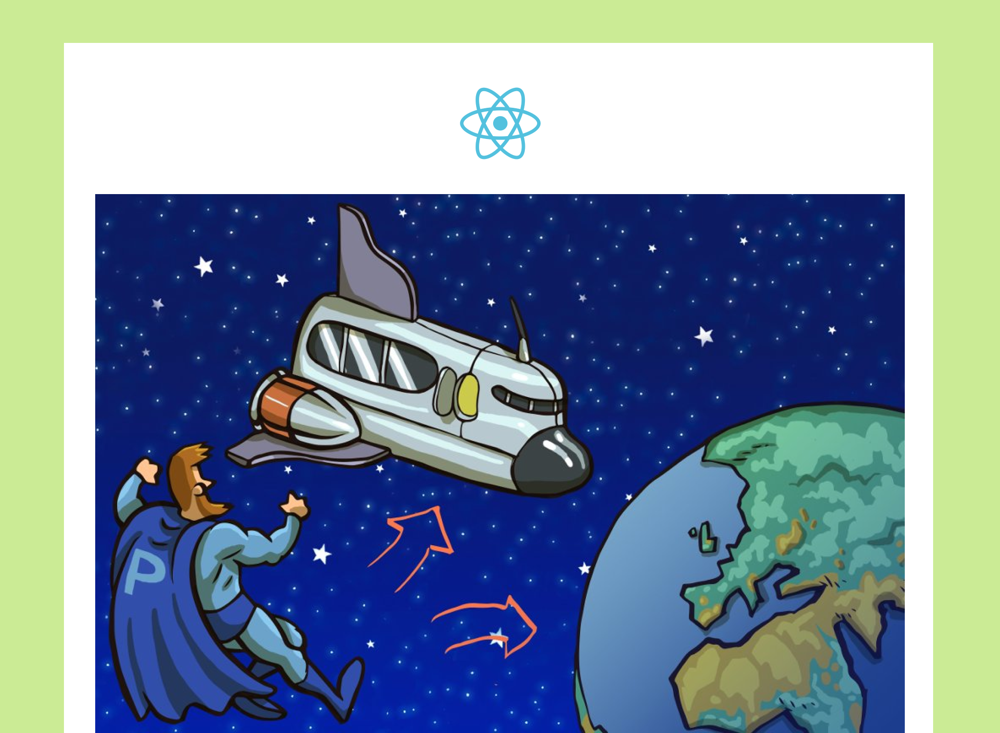
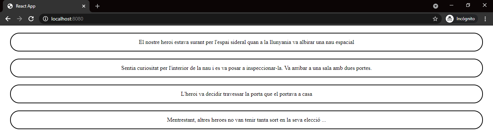
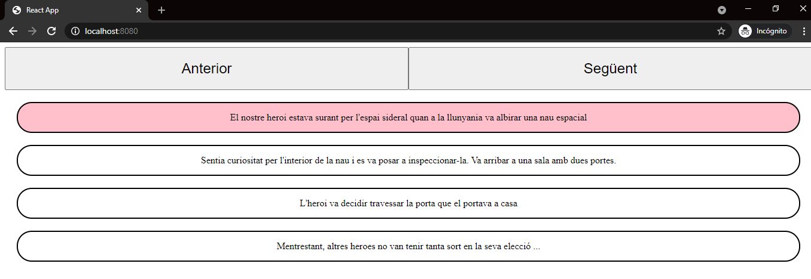
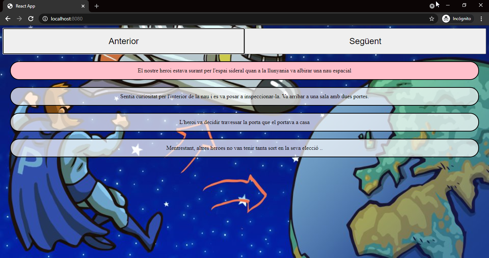

# Sprint 6. React I



### ****[Live Site]( https://react-sprint5.netlify.app/)****

### **🎯 Objetivos generales**

- Conoce cuáles son las funciones básicas de React.

### **🎯 Objetivos específicos**

- Saber cuáles son las funciones básicas de React.
- Objetivos específicos
- Llevar a cabo el primer proyecto con el React.
- Conocer los componentes "funcionales" y los "props".
- Entender y saber programar con JSX.
- Conocer los hooks básicos de React: useRef y useState.
- Saber implementar el renderizado condicional.
- Estilos en React y Stylet Components.

### **📌 Descripción**

Un/a cliente/a que tiene como producto principal una web de gestión empresarial desarrollada con React, nos ha pedido que desarrollemos un tutorial, en el que mediante dos botones los nuevos usuarios puedan avanzar y retroceder en los consejos, modificándose el texto de ayuda y la imagen de fondo.

Como por el momento no tenemos el material necesario para crear el tutorial, le mostraremos al cliente/a los siguientes 4 pasos:


## ****Nivel I ⭐️****

**Ejercicio 1**
Como ya hemos indicado, una aplicación con React está compuesta de componentes, digamos que cada componente es una pieza del puzle, teniendo estos componentes un propósito único y obvio.

Puedes crear tantos componentes como quieras, y siempre que lo consideres necesario, puedes utilizar uno o varios componentes dentro de otro.

Por ejemplo, si hiciéramos una landing page con React, dentro del componente principal (base de la web) podríamos importar el componente header, menú, formulario de contacto…

En este primer ejercicio, crearemos un componente que se encargará de renderizar una frase, y le importaremos y usaremos en el componente principal App.

**Tienes que llevar a cabo los siguientes pasos:**

- [x] 1. Crear la carpeta componentes.
- [x] 2. Crear la carpeta escena dentro de la carpeta componentes.
- [x] 3. Dentro de la carpeta escena implementaremos el primer componente. Para ello debes crear el archivo Escena.js. Este primer componente sólo debe devolver el siguiente string:

“Nuestro héroe estaba flotando por el espacio sideral cuando a lo lejos divisó una nave espacial”

1. Ya tenemos nuestro primer componente creado, pero todavía no se mostrará la frase. 
2. Para ello utilizaremos nuestro flamante componente Escena. 
3. En el return del componente app debes utilizar el componente Escena.

 - [x] 📬 Entregado


**Ejercicio 2**

En este ejercicio haremos que se muestren todas las frases de la historia.

Para ello, debes llevar a cabo las siguientes tareas:

- [ ] 1. Leeremos los datos de un archivo JSON o JS, con los textos de la historia en el componente App:

```
[
"Nuestro héroe estaba flotando por el espacio sideral cuando a lo lejos divisó una nave
espacial”,
“Sentía curiosidad por el interior de la nave y se puso a inspeccionarla. Llegó a una sala con dos puertas.”,
“El héroe decidió atravesar la puerta que le llevaba a casa”,
“Mientras tanto, otros héroes no tuvieron tanta suerte en su elección…”
]
```
- [ ] 2. Se debe pasar por **props** cada uno de los textos de la historia al componente Escena. (El componente escena renderizará una sola línea de texto).

- [ ] 3. Modificaremos el **componente Escena** para mostrar todas las líneas de texto obtenidas del componente padre App mediante **props**.


 - [ ] 📬 Entregado


**Ejercicio 3**

Es el momento de aplicar estilos a nuestro componente Escena. Tienes que maquetar este componente utilizando styled-components:



 - [ ] 📬 Entregado


**Ejercicio 4**

Mostraremos todas las líneas de la aplicación, pero resaltaremos sólo una cada vez, que irá cambiando a medida que pulsamos los botones de avanzar o retroceder:



 - [ ] 📬 Entregado

***

## ****Nivel II ⭐️⭐️****

**Ejercicio 5**

¡ENHORABUENA!, ¡ya has creado la base del proyecto!, ya se puede navegar por la historia indicando al usuario/a en qué punto se encuentra.

Sería conveniente mostrar al usuario una pantalla inicial de bienvenida, que contenga la descripción del proyecto y un botón de empezar. En este ejercicio debes usar el renderizado condicional.

**Ayuda:** ¿Cómo implementar el renderizado condicional? Mediante una variable guardada en el state del componente principal App, serás capaz de mostrar la pantalla de bienvenida, y una vez que esa variable cambie, ocultar la pantalla de bienvenida y mostrar la pantalla con la historia.

***

## ****Nivel III ⭐️⭐️⭐️****


**Ejercicio 6**
Ya sólo te falta modificar la imagen de fondo según el usuario vaya cambiando de frase.

Modificar el archivo JSON y convertirlo en un archivo JS con un array de objetos. Cada objeto tendrá dos propiedades: txt e img:

- txt será la propiedad que almacenará el texto de la escena.
- img será la propiedad que almacenará la imagen de fondo que se verá en la pantalla.


Como en el array ya tienes la frase a mostrar junto a su imagen, te resultará sencillo dinamizar el atributo "src" de la imagen.

